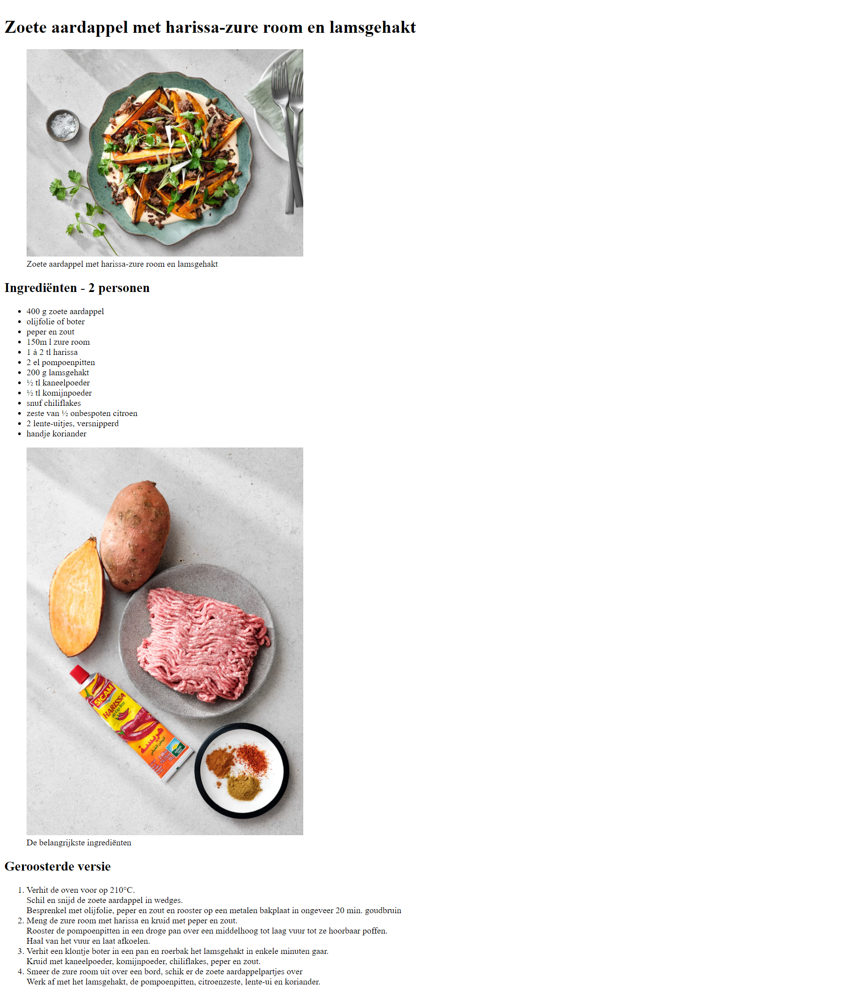
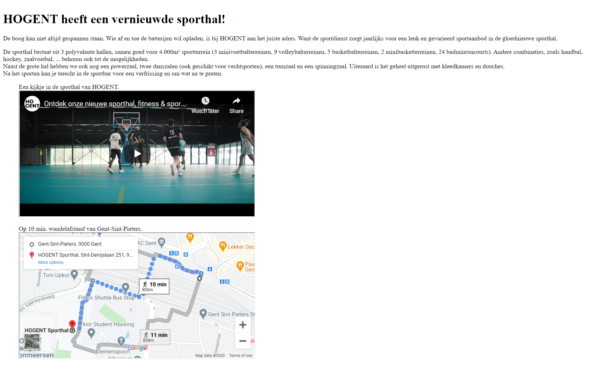

# Les 4 - Gevorderde Oefeningen H5/H7 - Afbeeldingen & Tabellen

Download en unzip, of clone deze repository. Hiervoor klik je op de groene knop.

## Oefening 1 - Books
Open de pagina **books.html** in de map **Books** en maak onderstaande tabel. 

---

## Oefening 2: Schilderwerken Vander Beken

Deze oefening is een webapplicatie met meerdere pagina's.

Maak deze oefening in de map VanderBeken. Merk op dat deze map reeds is aangemaakt en reeds alle afbeeldingen bevat die in de oefening worden gebruikt.

**Maak je webapplicatie structuur als volgt aan.**

1. Maak de volgende submappen aan:
    - images: voor de afbeeldingen
    - images/thumbs: voor de thumbnail afbeeldingen
    - realisaties voor de pagina's waar de realisaties als afbeelding wordt weergegeven.
    
    Verplaats de afbeeldingen naar de juiste mappen.
2. Maak in de root van je applicatie 5 nieuwe bestanden aan, maak gebruik van emmet (**!*tab***):
    - index.html
    - over_ons.html
    - realisaties.html
    - partners.html
    - contact.html 
3. Maak in de realisaties map 5 nieuwe bestanden aan:
    - schilderwerken_appartement.html
    - schilderwerken_muurtechniek.html
    - schilderwerken_toonzaal.html
    - schilderwerken_winkel.html

Nu zou je volgende structuur moeten hebben in de map VanderBeken:

Opmerking: alle titles van de pagina's (tabblad browsers) zijn *Schilderwerken Vander Beken*

### **index.html**
- Begin met een logische opbouw: header - nav – main – footer – article –aside – section - …
- De content (tekst) vind je in het bestand TekstVanderBeken.txt

### **over_ons.html**

### **realisaties.html**

- De gebruikte afbeeldingen zijn thumb_appartement.jpg, thumb_muurtechniek.jpg, …
- Als je op thumb_appartement.jpg klikt, kom je op de pagina schilderwerken_appartement.html terecht. Analoog bij de andere drie afbeeldingen.
- Voeg in de schilderwerken_....html pagina’s de correcte verwijzing naar de webpagina met de volledige afbeelding toe.

Voorbeeld van **schilderwerken_appartement.html**

### **partners.html**

### **contact.html**

---

## Oefening 3 - Recept
Maak een pagina **recept.html** in de map **Recept**, deze map bevat reeds een submap **images** met de afbeeldingen. Bouw de pagina op, gebaseerd op onderstaand voorbeeld. Zorg voor een goede logische structuur en let op de details, er zitten heel wat speciale karakters in de tekst. Neem een pauze bereid dit gerecht. Smakelijk! 

---

## Oefening 4 - Sporthal
- Open de pagina **index.html** in de map **Sporthal**. 
- Open de video _Ontdek onze nieuwe sporthal, fitness & sportsbar_. Je vindt de video op het HoGent-kanaal op Youtube. - Ga via **share - embed** en kopieer de code voor het **iframe**-element. 
- Plaats het **iframe**-element binnen het **aside**-element. Maak gebruik van een **figure**-element om tot onderstaand resultaat te komen.
- Ga op analoge wijze te werk om een kaartje met de wandelroute van Gent-Sint-Pieters tot de sporthal toe te voegen. 
- Valideer de pagina.
- Verwijder de attributen _frame-border, width en height_ uit de **iframe**-elementen en valideer de pagina opnieuw.
- Voeg in de **head** een **link** toe. De link moet verwijzen naar _site.css_ in de map _css_ en is een _stylesheet_ voor deze pagina. 
- Neem een pauze en ga een uurtje sporten. Veel plezier!

